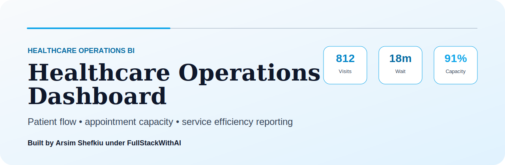

# Healthcare Operations BI Dashboard

> Healthcare operations dashboard for patient flow, appointment capacity, department performance, wait times, and service efficiency visibility.

Built by **Arsim Shefkiu** under **FullStackWithAI**.

[www.designhubmk.com](https://www.designhubmk.com) · arsim@designhubmk.com · [GitHub: fullstackwithai](https://github.com/fullstackwithai)

---

## Healthcare Operations Theme

> **Patient flow to operational clarity. Service data to better capacity decisions.**

This repository is presented as a premium healthcare operations BI dashboard for tracking patient flow, appointment utilization, department load, service wait times, and operational efficiency.

| Theme Layer | Direction |
|---|---|
| **Design Identity** | Clean blue, white, slate, and healthcare operations accents |
| **Product Feel** | Healthcare command center / patient-flow operations dashboard |
| **Audience** | Clinic managers, healthcare admins, analysts, BI hiring managers |
| **Core Message** | Patient volume + wait times + capacity + department performance |

---

## Operations KPI Layer

| KPI | Purpose |
|---|---|
| **Patient Volume** | Tracks service demand |
| **Average Wait Time** | Measures patient experience and bottlenecks |
| **Appointment Utilization** | Shows schedule efficiency |
| **Department Load** | Compares operational pressure across teams |
| **No-Show Rate** | Reveals wasted capacity and scheduling risk |

---

## Business Questions

| Question | Why It Matters |
|---|---|
| **Where are wait times increasing?** | Helps improve patient experience |
| **Which departments are overloaded?** | Supports staff and capacity planning |
| **Where are appointments underused?** | Helps recover lost scheduling capacity |
| **Which service areas need attention?** | Turns healthcare operations data into action |

---

## What This Project Demonstrates

| Capability | Evidence in This Repo |
|---|---|
| **Healthcare Analytics** | Patient flow, wait time, utilization, and department KPIs |
| **Operations BI Thinking** | Healthcare workflows translated into dashboard views |
| **Executive Reporting** | Service efficiency metrics presented clearly |
| **Data Storytelling** | Turns operational metrics into service improvement recommendations |
| **Portfolio Positioning** | Strong DA/BI project for healthcare, operations, and analytics roles |

---

## Suggested Project Architecture

```text
healthcare-operations-bi-dashboard/
├── assets/
│   └── readme-hero.svg
├── data/
│   └── healthcare-operations-sample.csv
├── sql/
│   └── patient-flow-analysis.sql
├── dashboard/
│   ├── index.html
│   ├── styles.css
│   └── app.js
├── insights/
│   └── operations-summary.md
└── README.md
```

---

## Creator & Brand

### Built by **Arsim Shefkiu** under **FullStackWithAI**

> **Healthcare operations theme focused on patient flow, service efficiency, capacity visibility, and operational decision support.**

| Creator Focus | Brand Positioning |
|---|---|
| I build operations dashboards that turn service data into clearer planning and performance insight. | **FullStackWithAI** represents premium portfolio work around practical BI dashboards, polished presentation, and AI-assisted execution. |

**Theme:** Healthcare BI · Patient Flow · Service Efficiency · Operations Intelligence

[www.designhubmk.com](https://www.designhubmk.com) · arsim@designhubmk.com · [GitHub: fullstackwithai](https://github.com/fullstackwithai)
